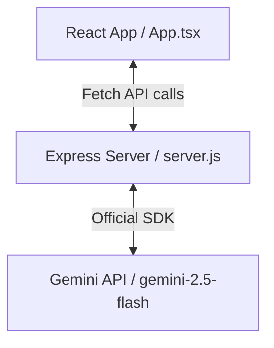

# 🍲 Mindful Meals — Agent Guide (AGENTS.md)

Welcome! This document provides technical context, codebase conventions, and operational guidelines for AI agents and developers working on the **Mindful Meals** repository.

For strict, detailed engineering standards addressing codebase improvements (including safety, type cleanliness, and AI prompting rules), refer to the new [Documentation Index (docs/)](docs/README.md) before making edits.

---

## 📌 Project Overview
**Mindful Meals** is an ADHD-friendly meal planning and kitchen assistant web application designed to minimize decision fatigue and cognitive overwhelm. 

### Core Tech Stack
*   **Frontend Client:** React (Single Page Application) built with TypeScript, styled using Tailwind CSS (via CDN configuration).
*   **Build Tool / Dev Server:** Vite handles the local development server and frontend bundling.
*   **Backend Server:** Node.js and Express server serving the static frontend build and routing AI requests.
*   **AI Integration:** Google Gemini API (`gemini-2.5-flash`) via the official `@google/genai` SDK.

---

## 📂 Repository Layout
An annotated map of the repository's directories and key configuration files:

```
mindful-meals/
├── index.html                   # HTML entry point; loads Tailwind via CDN & defines config
├── index.tsx                    # Root entry point; mounts React App (loaded by index.html)
├── package.json                 # Frontend dependencies and build/test script definitions
├── tsconfig.json                # TypeScript compiler options
├── vite.config.ts               # Vite server, port, and resolution configuration
├── Dockerfile                   # Multi-stage Docker build for containerization
├── cloudbuild.yaml              # CI/CD Google Cloud Build pipeline configuration
├── server/                      # Express Backend Server source
│   ├── server.js                # Server entry point, rate limiting, and static serving
│   ├── package.json             # Server-specific dependencies
│   ├── routes/                  # Express API routes
│   │   └── ai.js                # AI logic, prompts, and schema structures (Gemini API)
│   └── public/                  # Backend public static assets
│       ├── service-worker.js    # Service worker cache and fetch handler
│       └── websocket-interceptor.js # Utility injected into page head by the server
├── src/                         # React Frontend Client source
│   ├── App.tsx                  # Main client component (manages global state and routing)
│   ├── types.ts                 # Common TypeScript interfaces and enums
│   ├── constants.ts             # Initial pantry, preferences, and static NAV items
│   ├── services/
│   │   └── geminiService.ts     # Client service calling the backend server routes
│   └── components/              # UI Component layers
│       ├── common/              # Base widgets (Buttons, Icons, Modals)
│       ├── Dashboard.tsx        # Energy logger and meal summaries
│       ├── MealPlan.tsx         # Weekly view, batch prep toggles, recipe actions
│       ├── Pantry.tsx           # Checklist inventory & receipt scanning flow
│       ├── ShoppingList.tsx     # Smart consolidated grocery list
│       ├── FridgeRescue.tsx     # Visual recipe brainstorm from fridge photos
│       ├── Cookbook.tsx         # Favorite recipes library
│       └── YouTubeSources.tsx   # Stub component (currently empty)
└── scratch/                     # Directory for developer testing files and playground
```

---

## ⚙️ Development Setup
A local development environment requires setting up both the frontend and backend servers.

### Prerequisites
*   Node.js (v18 or higher recommended)
*   A Gemini API Key (obtained from [Google AI Studio](https://aistudio.google.com/))

### 1. Backend Setup & Secrets
Secrets must only live on the server to prevent exposing keys on the client.
1. Create a `.env` file in the `server/` directory:
   ```bash
   cd server
   touch .env
   ```
2. Configure your keys:
   ```env
   GEMINI_API_KEY=your_gemini_api_key_here
   PORT=3001
   ```
3. Install dependencies:
   ```bash
   npm install
   ```

### 2. Frontend Setup
1. In the repository root, install the dependencies:
   ```bash
   npm install
   ```

---

## 🛠️ Build & Test Commands

Use the following exact commands to build, test, and run the project:

| Task | Command | Directory | Description |
|---|---|---|---|
| **Start Backend Dev Server** | `npm run dev` | `./server` | Runs Express with `nodemon` on port 3001. |
| **Start Frontend Dev Server** | `npm start` | Root (`.`) | Runs the Vite server on port 3000. Proxies `/api` to port 3001. |
| **Build Frontend** | `npm run build` | Root (`.`) | Builds frontend assets to `./dist` and copies them to `./server/dist/`. |
| **Run Tests** | `npm test` | Root (`.`) | Runs test suites via `react-scripts test`. |
| **Run Production Server** | `npm start` | `./server` | Runs the Express server in production mode (serves static frontend and API on the port configured in process.env.PORT, defaulting to 3000). |

> [!IMPORTANT]
> The frontend production build (`npm run build`) **must** pass and be copied into `./server/dist` before deploying, as the Express server serves assets from there.

---

## 🎨 Code Style & Conventions
Follow these styling and conventions to match the existing codebase design:

*   **TypeScript:** Code must be fully typed. Avoid the `any` type. Update `src/types.ts` for model changes.
*   **Component Architecture:** Components should be modular. Place presentation widgets inside `src/components/common/`.
*   **Naming Conventions:**
    *   React Components: PascalCase (e.g., `FridgeRescue.tsx`).
    *   Constants & Services: camelCase (e.g., `geminiService.ts`, `constants.ts`).
    *   Enums: PascalCase keys, UPPERCASE values (e.g., `EnergyLevel.FullPower = 'FULL_POWER'`).
*   **Styling (Tailwind):** Do not install standard Tailwind npm compile pipelines. The project loads Tailwind CSS via the CDN script tag in `index.html`. Custom themes and colors are defined via inline CSS variables in the `<style>` block of `index.html`.
*   **State Persistence:** App-level states (preferences, pantry, meal plan, cookbook, shopping list) are managed in `src/App.tsx` and persisted in `localStorage`.

---

## 🏗️ Architecture Notes

### Client-Server Flow


### Data Synchronization & Injections
1.  **HTML Modification:** When a user requests `/`, the Express server reads `dist/index.html`, injects a service worker script and a WebSocket interceptor script tag into the `<head>` dynamically, and returns the modified HTML.
2.  **Shopping List Generation:** The shopping list is automatically generated client-side by comparing required recipe ingredients against in-stock pantry items, debounced by 1 second on any change in state.

### AI Integration Endpoints
All requests are routed through `server/routes/ai.js`. Gemini prompts are strongly structured using JSON schema configurations:
*   `recipeSchema`: Restricts the recipe structure output including preparation steps, cooking times, energy level tag, and substitutions.
*   `receiptItemSchema`: Extracts grocery name, quantity, unit, and maps them to one of the 21 predefined `PANTRY_CATEGORIES`.
*   `shoppingListItemSchema`: Formats consolidated shopping items mapped to designated stores.

---

## 🔄 Contribution Workflow
We practice trunk-based development on the `main` branch.

*   **Branch Naming Strategy:**
    *   Feature branches: `feature/<short-description>`
    *   Bug fix branches: `fix/<short-description>`
    *   Chore/Refactoring branches: `chore/<short-description>`
    *   AI Agent branches: `agent/<task-id-or-short-description>`
*   **Commit Message Convention:**
    *   All agent commits must start with `[agent]` (e.g., `[agent] fix: resolve null reference in cookbook filter`).
    *   Standard format: `<type>: <short summary>`.
*   **Pull Requests:**
    *   PR titles must start with `[Agent]` if created by an AI agent.
    *   Write a thorough description detailing what task triggered the change, modified files, assumptions, and points of uncertainty.
    *   Reviewers must approve the PR before merging; do not self-merge.

---

## 🤖 Agent-Specific Instructions

### 🚨 Never Edit Directly
*   **`dist/` & `server/dist/`**: These folders are automatically updated by the `npm run build` command. Direct changes will be overwritten.
*   **`package-lock.json` & `server/package-lock.json`**: Always use `npm install` to manage dependencies rather than modifying lock files manually.

### 💡 Preferred Implementation Patterns
*   **AI Changes:** When adding new AI capabilities, define your schema in `server/routes/ai.js`, implement the backend endpoint under `/api/...`, and expose it on the frontend via `src/services/geminiService.ts`.
*   **Pantry updates:** If you introduce new default items, make sure to add them to `INITIAL_PANTRY` in `src/constants.ts` with correct categorizations.
*   **Testing:** As there are currently no test files tracked in the repository, any complex service or component added should ideally include a corresponding unit test file alongside the module (e.g. `src/services/__tests__/geminiService.test.ts`).

### ⚠️ Pitfalls & Footguns to Avoid
*   **Vite Cache / Build Delay:** Remember that frontend edits are only served by the backend Express server *after* running `npm run build`. If you run standard `node server.js` without building, your changes won't be visible.
*   **API Key Leakage:** Do not add `GEMINI_API_KEY` to the client-side code, Vite configuration, or root `.env`. Keep it strictly in the `server/.env` file.
*   **Tailwind CDN Extension:** Since Tailwind classes are processed at runtime by the CDN script, any dynamically constructed class names (e.g. `bg-energy-${level}`) must exist in the HTML tailwind config colors mapping or be safe from tailwind's class name scanning constraints.
