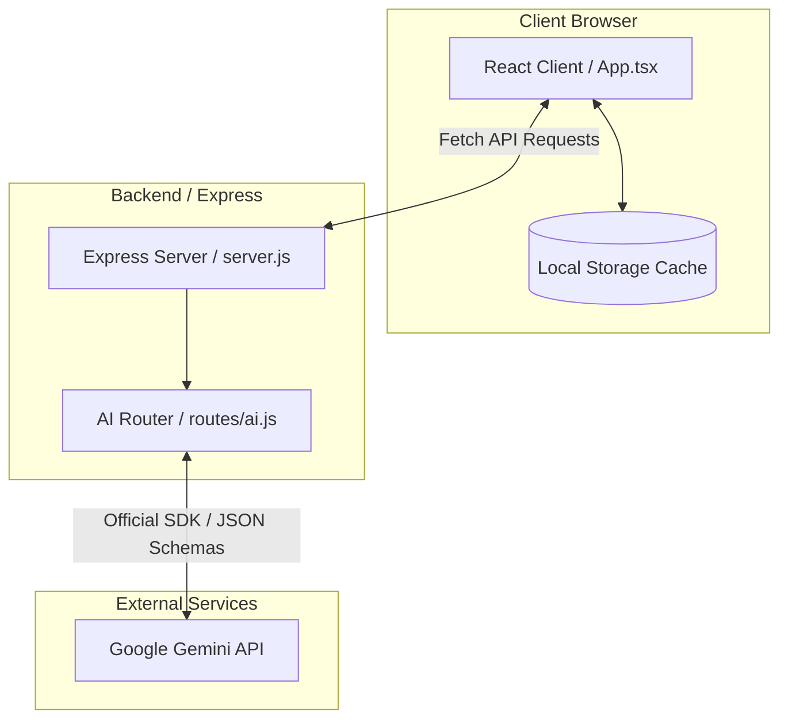

# 🏛️ System Architecture

This document details the high-level architecture, client-server communications, state synchronization strategies, and integration points for **Mindful Meals**.

---

## 📋 Table of Contents
1. [System Topology](#1-system-topology)
2. [Client-Server Communication & Routing](#2-client-server-communication--routing)
3. [Client State & Data Synchronization](#3-client-state--data-synchronization)
4. [Backend Injections & Interceptors](#4-backend-injections--interceptors)
5. [Shared Constants Architecture](#5-shared-constants-architecture)

---

## 1. System Topology

Mindful Meals is designed as a lightweight Single Page Application (SPA) backed by a Node/Express proxy layer that interfaces safely with the Google Gemini API.

---

## 2. Client-Server Communication & Routing

### Development Environment Routing
During local development, two servers run concurrently:
1.  **Frontend Dev Server (Vite):** Runs on port `3000`. Serves hot-reloading frontend assets.
2.  **Backend Dev Server (Node/Nodemon):** Runs on port `3001`. Serves API routes.
*   **Proxy Configuration:** `vite.config.ts` is configured to proxy all `/api` requests to `http://localhost:3001`. This avoids Cross-Origin Resource Sharing (CORS) complications during development.

### Production Environment Routing
In production, a single container hosts the entire application on the port specified by `process.env.PORT` (defaults to `3000` or `3001`).
*   **Static Serving:** The Express server (`server.js`) hosts the compiled frontend assets from the `./dist` (copied to `./server/dist`) folder.
*   **API Hosting:** Requests targeting `/api/*` are captured by server routes, while all other requests fall back to serving `index.html` (supporting SPA routing).

---

## 3. Client State & Data Synchronization

### Persistent Core State
Mindful Meals stores all user data client-side in the browser's `localStorage`. The global React state is managed inside [src/App.tsx](../src/App.tsx) and synchronized on modifications.

The core states include:
*   `preferences`: Dietary restrictions, customized shopping stores, and calendar views.
*   `pantryItems`: Checklist of ingredients, in-stock state, and categorizations.
*   `mealPlan`: Active week recipes mapped by day and meal type.
*   `shoppingList`: Dynamic consolidated list of grocery items.
*   `cookbook`: Favorite saved recipes.

### Shopping List Generation
The shopping list is computed client-side by comparing the list of ingredients required by the active `mealPlan` recipes against the items checked as "in-stock" in the `pantryItems`.
1.  **Aggregation:** Quantities and units are normalized and summed.
2.  **Exclusion:** Items marked "in-stock" in the pantry checklist are excluded from the shopping list automatically.
3.  **Store Mapping:** Grocery items are categorized and mapped to the preferred retail stores defined in `preferences.shoppingStores`.

---

## 4. Backend Injections & Interceptors (Removed)

### Removal of Injections & Service Worker
The service worker intercept configuration, websocket interceptor, and index.html regex script injection logic have been completely cleaned up and removed.
*   **Direct Serving:** The Express server (`server/server.js`) now serves static files directly from `dist/index.html` using standard file delivery mechanisms without dynamic injections or payload mutations.
*   **API Security:** All requests to Gemini run securely on the server-side, eliminating any need to intercept or proxy client-side Google API requests.

---

## 5. Shared Constants Architecture

### Shared Configuration File
To prevent drift between client interfaces and server validations, shared constants must be extracted into single-source files in the repository root.
*   **Example:** `shared/pantry-categories.json` stores the master list of 21 pantry categories (e.g. `Produce`, `Pantry Staples`, `Spices`).
*   **Backend Import:** The Node backend loads the constants using CommonJS `require()`.
*   **Frontend Import:** The Vite compiler resolves and bundles the constants using ESM `import` statements.
