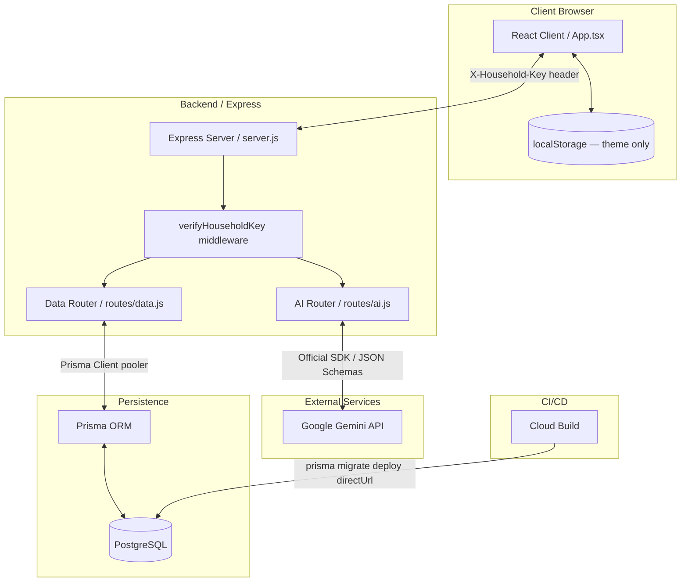

# 🏛️ System Architecture

This document details the high-level architecture, client-server communications, state synchronization strategies, and integration points for **Mindful Meals**.

---

## 📋 Table of Contents
1. [System Topology](#1-system-topology)
2. [Client-Server Communication & Routing](#2-client-server-communication--routing)
3. [Client State & Data Synchronization](#3-client-state--data-synchronization)
4. [Backend Injections & Interceptors](#4-backend-injections--interceptors)
5. [Shared Constants Architecture](#5-shared-constants-architecture)

---

## 1. System Topology

Mindful Meals is a Single Page Application (SPA) backed by a Node/Express server that interfaces with both the Google Gemini API and a PostgreSQL database (via Prisma ORM).

### Access Control
All `/api/*` routes (both AI and data) require an `X-Household-Key` request header. The server compares the value against `HOUSEHOLD_API_KEY` (Cloud Run secret) and returns `401` on mismatch. The client injects the key at build time via `VITE_HOUSEHOLD_API_KEY`. See [database-integration-plan.md](../plans/database-integration-plan.md) (Decision 2) for the full risk profile.

---

## 2. Client-Server Communication & Routing

### Development Environment Routing
During local development, two servers run concurrently:
1.  **Frontend Dev Server (Vite):** Runs on port `3000`. Serves hot-reloading frontend assets.
2.  **Backend Dev Server (Node/Nodemon):** Runs on port `3001`. Serves API routes.
*   **Proxy Configuration:** `vite.config.ts` is configured to proxy all `/api` requests to `http://localhost:3001`. This avoids Cross-Origin Resource Sharing (CORS) complications during development.

### Production Environment Routing
In production, a single Cloud Run container hosts the entire application.
*   **Static Serving:** The Express server (`server.js`) hosts the compiled frontend assets from `./server/dist`.
*   **API Hosting:** Requests targeting `/api/*` are captured by server routes; all other requests fall back to `index.html` (SPA routing).
*   **Database:** Cloud Run connects to Supabase PostgreSQL via the Supavisor connection pooler (port 6543).

### Route Namespaces
| Prefix | Router | Rate limit | Purpose |
|---|---|---|---|
| `/api/data/*` | `routes/data.js` | 300 req / 15 min | Persistent user data (sync, preferences, pantry, etc.) |
| `/api/*` | `routes/ai.js` | 100 req / 15 min | Gemini AI features |

---

## 3. Client State & Data Synchronization

### Persistence model
User data is stored in a PostgreSQL database (Prisma schema at `server/prisma/schema.prisma`) and synced to the React client on mount. `localStorage` is no longer the source of truth for durable data.

| Data | Stored where |
|---|---|
| `preferences` | DB — `Preference` model |
| `pantry` | DB — `PantryItem` model |
| `mealPlan` (slots + recipes) | DB — `MealPlanSlot` + `Recipe` models |
| `cookbook` (favorites) | DB — `Recipe` model (`isFavorite: true`) |
| `shoppingList` manual items | DB — `ShoppingListItem` model |
| `shoppingList` generated item check-state | DB — `ShoppingListCheck` model |
| `weeklyPreferencesByWeek` | DB — `WeeklyNote` model |
| `weekDaySelections` | DB — `WeekDaySelection` model |
| `theme` | `localStorage` only (device preference, not synced) |
| `energyLevel` | In-memory session state only |
| Shopping list generated items | Recomputed client-side via `generateShoppingList()` |

### Sync strategy — optimistic UI + debounced snapshot writes

1.  **Instant UI** — React state updates immediately on user action (no loading gates).
2.  **Non-blocking initial load** — App renders with hardcoded `INITIAL_*` defaults, then `GET /api/data/sync` runs in the background and replaces state on success.
3.  **Debounced background writes** — Each resource type has an independent 1 s debounce timer. State changes trigger a `PUT /api/data/<resource>` with the full current snapshot for that resource.
4.  **Failure recovery** — On write failure, the `useSyncState` hook reverts the affected resource using a three-tier stack: last server snapshot → session cache → `INITIAL_*` defaults. A dismissible banner prompts the user to retry.

### `useSyncState` hook
`src/hooks/useSyncState.ts` owns all sync logic: `syncStatus`, debounce timers, the PUT queue (flushed as latest-per-resource on load completion), revert stack, and `BroadcastChannel` coordination across tabs. See [database-integration-plan.md](../plans/database-integration-plan.md) (Section 4.9) for the full implementation contract.

### Shopping List Generation
The generated portion of the shopping list is computed client-side by comparing the `mealPlan` recipes' ingredients against the `pantryItems` marked "in-stock".
1.  **Aggregation:** Quantities and units are normalized and summed.
2.  **Exclusion:** Items marked "in-stock" in the pantry are excluded automatically.
3.  **Store Mapping:** Items are mapped to preferred stores from `preferences.shoppingStores`.
4.  **Check-state persistence:** User check-marks on generated items are persisted in `ShoppingListCheck` rows keyed by normalized item name (best-effort across regenerations).

---

## 4. Backend Injections & Interceptors (Removed)

### Removal of Injections & Service Worker
The service worker intercept configuration, websocket interceptor, and index.html regex script injection logic have been completely cleaned up and removed.
*   **Direct Serving:** The Express server (`server/server.js`) now serves static files directly from `dist/index.html` using standard file delivery mechanisms without dynamic injections or payload mutations.
*   **API Security:** All requests to Gemini run securely on the server-side, eliminating any need to intercept or proxy client-side Google API requests.

---

## 5. Shared Constants Architecture

### Shared Configuration File
To prevent drift between client interfaces and server validations, shared constants must be extracted into single-source files in the repository root.
*   **Example:** `shared/pantry-categories.json` stores the master list of 21 pantry categories (e.g. `Produce`, `Pantry Staples`, `Spices`).
*   **Backend Import:** The Node backend loads the constants using CommonJS `require()`.
*   **Frontend Import:** The Vite compiler resolves and bundles the constants using ESM `import` statements.
